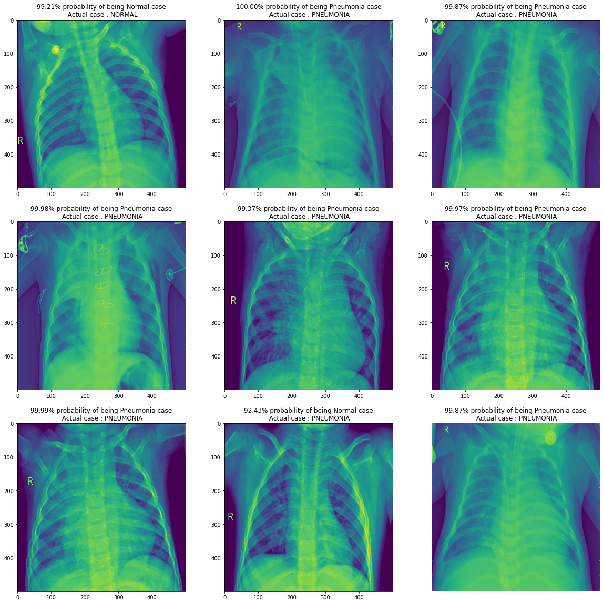
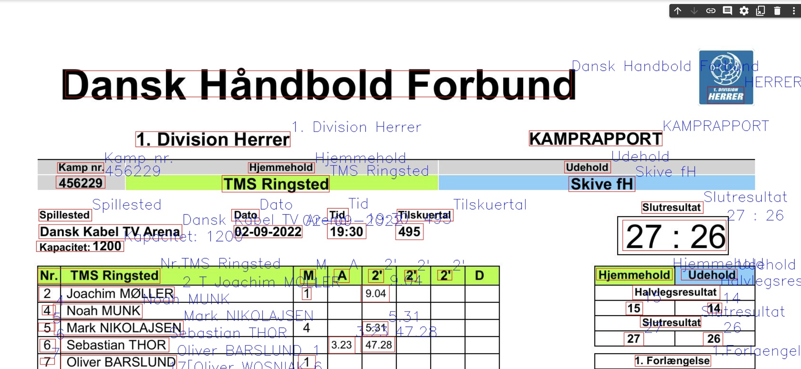
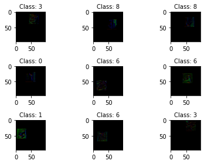

# Portfolio

:envelope: [damiantrzc@gmail.com](mailto:damiantrzc@gmail.com) &nbsp;&nbsp;&nbsp;&nbsp;&nbsp;&nbsp; :link: [LinkedIn](https://www.linkedin.com/in/trzcinskidamian/)

Welcome to my Portfolio GitHub Page. You will find here the projects I have worked on in the past few months, together with a detailed explanation and the code. <b>The page is currently under development!</b> More projects will be posted soon!

- [Portfolio](#portfolio)
  * [[Project 1: CNN on the Pneumonia X Ray images](https://github.com/datrz/its.damian/blob/main/CNN_on_Pneumonia_Xrays.ipynb)](#-project-1--cnn-on-the-pneumonia-x-ray-images--https---githubcom-datrz-itsdamian-blob-main-cnn-on-pneumonia-xraysipynb-)
  * [[Project 2: OCR on Danish Handball Match Reports](https://github.com/datrz/its.damian/blob/main/Handball_Match_Report_with_PaddleOCR.ipynb)](#-project-2--ocr-on-danish-handball-match-reports--https---githubcom-datrz-itsdamian-blob-main-handball-match-report-with-paddleocripynb-)
  * [[Project 3: CNN for recognition of tricky images with 10 classes](https://github.com/datrz/its.damian/blob/main/Assignment_cnn_Best_Score.ipynb)](#-project-3--cnn-for-recognition-of-tricky-images-with-10-classes--https---githubcom-datrz-itsdamian-blob-main-assignment-cnn-best-scoreipynb-)

## [Project 1: CNN on the Pneumonia X Ray images](https://github.com/datrz/its.damian/blob/main/CNN_on_Pneumonia_Xrays.ipynb)
The purpose of this project was to develop an effective classification model, that will predict whether a patient should be diagnosed with Pneumonia or not, based on X-Ray images of their chest. I have built a Convolutional Neural Network, that achieved 92% accuracy on the new test set and scored 2nd place during the Deep Learning course, out of 11 groups. You can explore the code, following the link attached in the headline.

The project consisted of:
- Preparation and preprocessing of the dataset
- Augumenting the training dataset of images
- Building, training and evaluating model architecture
- Testing it on a new data

## [Project 2: OCR on Danish Handball Match Reports](https://github.com/datrz/its.damian/blob/main/Handball_Match_Report_with_PaddleOCR.ipynb)
The purpose of the project was to investigate a possibility of automatical reading of the Danish Handball League Match Reports in order to transfer them into a DataFrame at the later stage of the project. The data would be used then to create a Dashboard, summarizing different parameters as well as investigated in terms of building useful Machine Learning models.

The project involved
- Getting familiar with Paddle OCR library
- Fitting Paddle OCR models to the example dataset
- Verifying accuracy of prediction
- Annotating the predictions on the pictures for better evaluation of the effectiveness of the model

## [Project 3: CNN for recognition of tricky images with 10 classes](https://github.com/datrz/its.damian/blob/main/Assignment_cnn_Best_Score.ipynb)
In this assignment from Applied Machine Learning course, I needed to develop a convolutional neural network to predict values in a classification problem with 10 classes. The images have shape 96x96 and are in color. When it was done, I needed to submit the results on the Kaggle webpage for the in class competition. I could submit 5 times every day, so you can experiment with different infrastructures. I scored 1st place in this competition, out of 14 competing teams.

The assignment involved:
- Getting familiar with the dataset
- Testing various model architecures
- Evaluating what parameters are helping the most when tuning the model
- Augumenting the images, as provided dataset challenging
